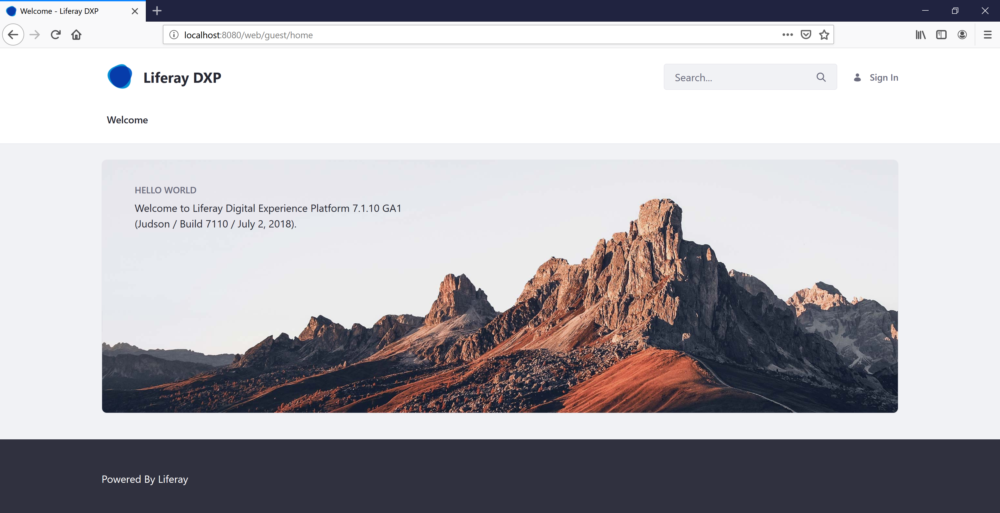

# Using the Liferay Commerce Tomcat Bundle

The Liferay Commerce open source bundle is available for download from the [Liferay Commerce Community Downloads](https://commerce.liferay.dev/download) page. The bundle contains the latest version of Liferay Commerce and Liferay Portal CE pre-deployed to Apache Tomcat.

Before obtaining the bundle, read the [Liferay Commerce Compatibility Matrix](https://web.liferay.com/documents/14/21598941/Liferay+Commerce+2.0+Compatibility+Matrix/0ed97477-f5a7-40a6-b5ab-f00d5e01b75f) for a list of supported technologies.

To use the Liferay Commerce bundle, follow these steps:

1. Get the Liferay Commerce Tomcat Bundle

    * [Download Page](https://commerce.liferay.dev/download)

1. Unzip the bundle to the target location.

1. Start the Tomcat bundle
    * Navigate to `$CATALINA_HOME/bin`.
    * Execute `./catalina.sh run`.
      > For Windows users, run: `catalina run`
    > Wait until you see `org.apache.catalina.startup.Catalina.start Server startup in [x] milliseconds`

1. Open your browser to `https://localhost:8080`.

## Additional Information

* [Installation Overview](../installation-overview/README.md)
* [Installing Liferay DXP](https://help.liferay.com/hc/en-us/articles/360028711012-Installing-Liferay-DXP)
* [Liferay Commerce 2.0 Compatibility Matrix](https://web.liferay.com/documents/14/21598941/Liferay+Commerce+2.0+Compatibility+Matrix/0ed97477-f5a7-40a6-b5ab-f00d5e01b75f)
