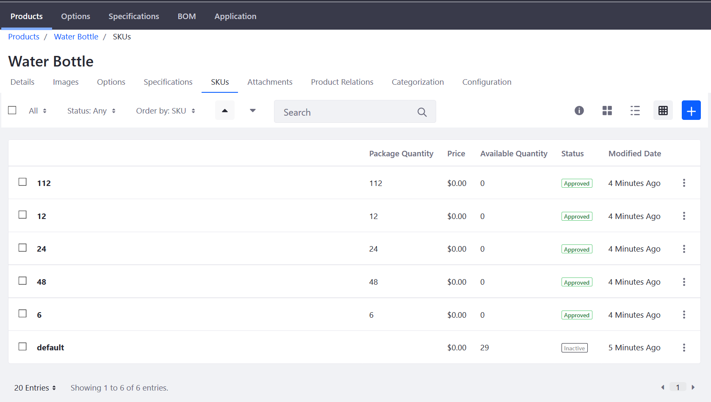

# Creating a Simple Product

A Simple Product is any physical product for which inventory is tracked. This article is a full walk through on how to add a product to your store catalog. The walk through includes comprehensive instructions on basic product settings (name and description), applying product options and generating SKUs, and other important considerations such as product image, specifications, and categorizations.

## Roadmap

* [Create a Simple Product](#create-a-simple-product)
* [Apply Product Options](#apply-product-options)
* [Generate SKUs](#generate-skus)
* [Set Prices and Quantities in the Inventory](#set-prices-and-quantities-in-the-inventory)
* [Configure Product Specifications](#configure-product-specifications)
* [Upload Product Images and Attachments](#upload-product-images-and-attachments)
* [Organize with Categories](#organize-with-categories)
* [Associate with Related Products](#associate-with-related-products)

### Create a Simple Product

1. Navigate to _Control Panel_ → _Commerce_ → _Products_.
1. Click the (+) button then _Simple_.
1. Enter the following:
   * **Catalog**: Sahara.com
   * **Name**: Water Bottle
   * **Short Description**: Stainless steel water bottle 20oz.
   * **Friendly URL**: (autogenerated)

      

1. Click _Publish_.

The initial product entry has been created. Continue on to learn about further configuring the product.

### Apply Product Options

[Product Options](../catalog/customizing-your-product-with-product-options.md) provide an easy and flexible way to offer products that have a variety of options such as size, quantity, and color. Click the _Options_ sub-tab to add various options to the product.

### Generate SKUs

Once you have applied product options to the product, SKUs have to be generated. For more information about how to generate SKUs, see [Adding SKUs to Your Products](../catalog/adding-skus-to-your-products.md). Click the _SKUs_ sub-tab to generate the SKUs.

### Set Prices and Quantities in the Inventory

After the SKUs have been generated, set the base price and quantities in the inventory for each item. Depending on how many SKUs were generated based on the various product options, each SKU can have its own prices. Some products are sold in bulk quantities while others are sold individually.

To set product prices and quantities:

1. Click the _3-dot_ icon then _Edit_ next to _6_. (At this point, you can rename the SKU to something more descriptive like _6 Pack_ on the _Details_ menu.)
1. Click _Pricing_ on the left menu.
1. Enter the following:
    * **Price**: 12.00
    * **Promo Price**: 0.00
    * **Cost**: 0.00
1. Click _Save_. (If Promo Price and Cost fields are left as 00, no discounts or promotions are applied at this point.)
1. Click _Price List_ to apply this product to any existing [price lists](../../../managing-price/price-lists/adding-products-to-a-price-list/README.md).

> To learn more about pricing, see: [Introduction to Product Pricing Methods](../../../managing-price/introduction-to-product-pricing-methods/README.md)

To learn how to configure inventory for your product, see: [Setting Inventory by Warehouse](../../../managing-inventory/setting-inventory-by-warehouse/README.md).

### Configure Product Specifications

[Product specifications](../catalog/specifications.md) contain useful pieces of product information about the product, such as dimensions, color, weight, capacity, or almost any other attribute. Click the _Specifications_ sub-tab to add specifications.

### Upload Product Images and Attachments

[Product images](../catalog/product-images.md) help to ensure that customers know what they are buying. Each product variant (SKU) can have their own associated product image. Click the _Images_ sub-tab to add all product images.

Store administrators can also add attachments that are associated with a particular product. Click the _Attachments_ sub-tab to add documents.

### Organize with Categories

[Product Categories](../catalog/creating-a-new-product-category.md) are used to organize products. Product Categories may be used to apply discounts or other offers to a set of products, to assist buyers in finding products, or to promote certain products to a specified account or account group.

### Associate with Related Products

[Product Relations](../../product-information/product-relations/README.md) are used to connect products. Once connected, a product displays the links to other products. Every related product must be assigned to a Product Relation Type.

## Additional Information

* [Introduction to Product Types](../introduction-to-product-types/README.md)
* [Creating a Grouped Product](../catalog/creating-a-grouped-product.md)
* [Creating a Virtual Product](../creating-a-virtual-product/README.md)
* [Setting Inventory by Warehouse](../../../managing-inventory/setting-inventory-by-warehouse/README.md)
