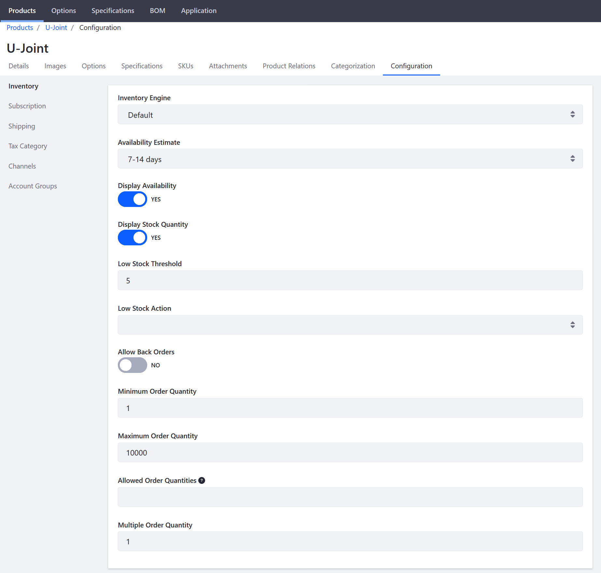

# Product Inventory Configuration Reference

Each product in the catalog can be configured to display inventory data in the storefront. Administrators can display the availability of each item as 'In Stock' or 'Out of Stock' and the available inventory total, when stock is low.

The out of stock threshold indicates when a product needs to be reordered, subtracts from the salable quantity for a stock, and can be set to support backorders. Administrators can allow backorders and set a maximum amount of orders.

To manage the inventory for each product, navigate to a Product's _Configuration_ tab then click _Inventory_ in the left menu.

| Field | Description |
| --- | --- |
| Inventory Engine | Dropdown menu to select a required Inventory Engine; can be customized using extension point |
| Availability Estimate | Dropdown menu to select length of time for how long it should take to resupply the product if inventory is depleted |
| Display Availability | Toggle to select whether to display a product is available for sale |
| Display Stock Quantity | Toggle to select whether to display the remaining amount of stock is available for sale |
| Low Stock Threshold | The number of products remaining before orders cannot be fulfilled due to unavailability |
| Low Stock Action | Dropdown menu to select whether to continue to display the product in the catalog or make it Unpublished |
| Allow Back Orders | Toggle to select whether to allow orders even when the product is out of stock |
| Minimum Order Quantity | The number of minimum items a buyer is required to buy |
| Maximum Order Quantity | The number of maximum items a buyer is allowed to buy |
| Allowed Order Quantities |  Order quantities are limited to any numbers entered. An entry of 2, 4, 6 allows buyers to purchase only those quantities. |
| Multiple Order Quantity | Only permit order quantities that are multiples of the number entered. |

## Additional Information

* [Implementing a Custom Low Stock Activity](../../../../developer-guide/tutorial/implementing-a-custom-low-stock-activity/README.md)
* [Low Stock Activity](../low-stock-activity/README.md)
