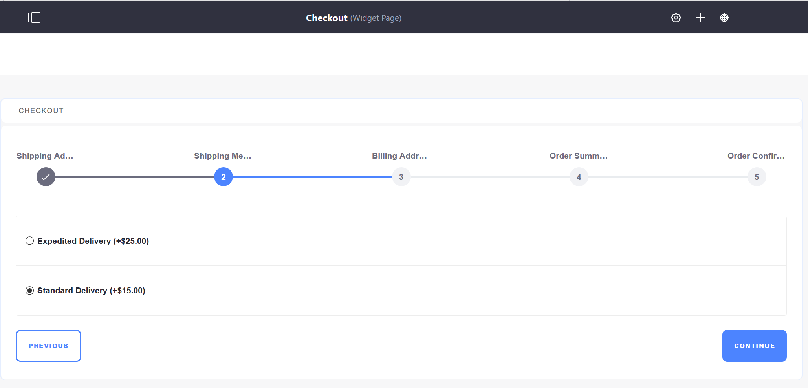
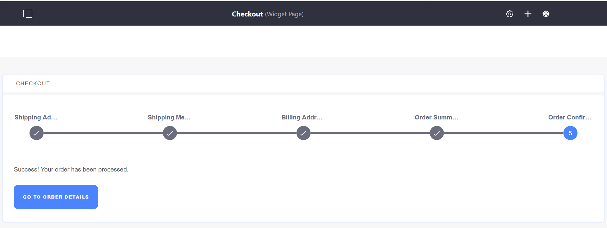

# Checkout

The Checkout page is a required page that contains the _Checkout_ widget. This widget is populated once a buyer clicks _Checkout_ to submit an order. Custom checkout steps can also be implemented using extension points. To learn more see [Implementing a Custom Checkout Step](../../developer-guide/tutorial/implementing-a-custom-checkout-step.md).

During the checkout process, there are several pages to enter the buyer's shipping and billing addresses and choose a shipment method. The last two pages are the _Order Summary_ and _Order Confirmation_.

## Entering a Shipping Address

Note that if the buyer checks the _Use shipping address as billing address_, this will skip the Billing Address page.

## Selecting Shipping Method

Shipping methods available to a buyer are configured by changing _Shipping Methods_ in _Site Administration_ → _Commerce_ → _Settings_ -> _Shipping Methods_. See [Using the Flat Rate Shipping Method](../sales/using-the-flat-rate-shipping-method.md) for more information.

## Entering a Billing Address

As noted above, this page appears only if the buyer's billing address is different from the shipping address.

## Viewing the Order Summary

## Confirming the Order

When an order is confirmed, the order is ready for processing by the seller. See [Order Life Cycle](../sales/order-life-cycle.md) for more information.

## Additional Information

* [Widget Reference Guide](../content/widget-reference.md)
* [Creating Pages](https://help.liferay.com/hc/en-us/articles/360018171291-Creating-Pages)
* [Implementing a Custom Checkout Step](../../developer-guide/tutorial/implementing-a-custom-checkout-step.md)
* [Using the Flat Rate Shipping Method](../sales/using-the-flat-rate-shipping-method.md)
