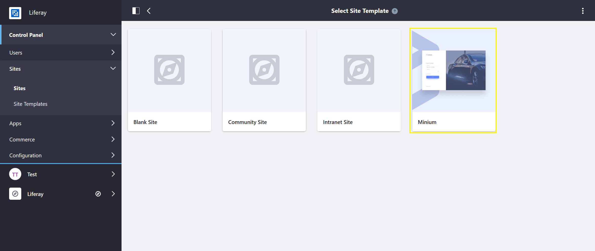

# Accelerators

Liferay Commerce Accelerators make building stores and exploring Liferay Commerce fast and easy.

> **Note**: Users who want to build their store from scratch are recommended to walk through [Getting Started](../../README.md).

Stores in Liferay Commerce are comprised of an interrelated hierarchy of components: Sites, Channels, Catalogs, Products, Pages, and Widgets. An Accelerator quickly and easily sets up a functional store by providing a pre-configured Site Template with a hierarchy of store components, a theme, pre-set store configurations, and sample data.

Liferay Commerce comes with Minium, a B2B site accelerator, out-of-the-box.

To use an Accelerator:

1. Go to _Control Panel_ → _Sites_ → _Sites_.
1. Click the (+) button to add a new site.
1. Choose an Accelerator (Minium).

    

1. Enter a name: _Your Site_.
1. Click _Save_.
1. In the Site Menu click _Go to Site_.

Your accelerated site has been created.

## Additional Information

* [Using the Minium Accelerator to Jump Start Your B2B Store](../getting-started/using-the-minium-accelerator-to-jump-start-your-b2b-store.md)
