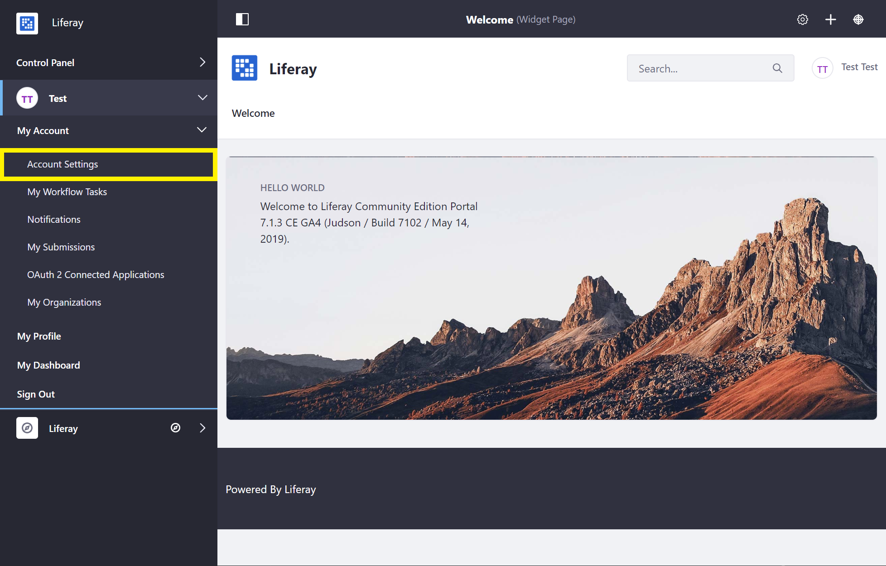

# Introduction to the Admin Account

The Admin user is created by default in any new installation of Liferay Commerce and has full permissions to modify every facet of a Liferay Commerce instance. The Admin user can create, modify, and delete sites, pages, users, accounts, catalogs and products, and perform all store and site administrative tasks.

## Accessing Liferay Commerce as the Admin User

1. Open a browser to `http://localhost:8080`.
1. Click the _Sign In_ link.

    

    > If a Liferay Commerce Bundle is being used, you will be presented with the [_Setup Wizard_](https://help.liferay.com/hc/en-us/articles/360017896652-Installing-Liferay-DXP-#using-the-setup-wizard). Follow the on-screen instructions to configure your Admin user.

1. Enter the default admin credentials to log in.

    > It is **highly** recommended that the default login credentials be updated when starting a new Liferay Commerce installation.

## Configuring the Admin User

### Changing Account Information

1. Open the _Product Menu_ and navigate to the _Account Menu_ -> _My Account_ -> _Account Settings_.

    

1. In the _Information_ tab, change or add user information as needed.

    

### Changing the Login Password

1. Open the _Product Menu_ and navigate to the _Account Menu_ -> _My Account_ -> _Account Settings_ -> _Password_.
1. Enter your _Current Password_ and provide a _New Password_.

    

    > **Note:** This screen is where the _Password Reminder Question_ may also be updated.

### Signing Out

To log out of your account:

1. Open the _Product Menu_ and navigate to the _Account Menu_ -> _Sign Out_.

    

## Additional Information

* [Introduction to Securing Liferay DXP](https://help.liferay.com/hc/en-us/articles/360017897072-Introduction-to-Securing-Liferay-DXP)
