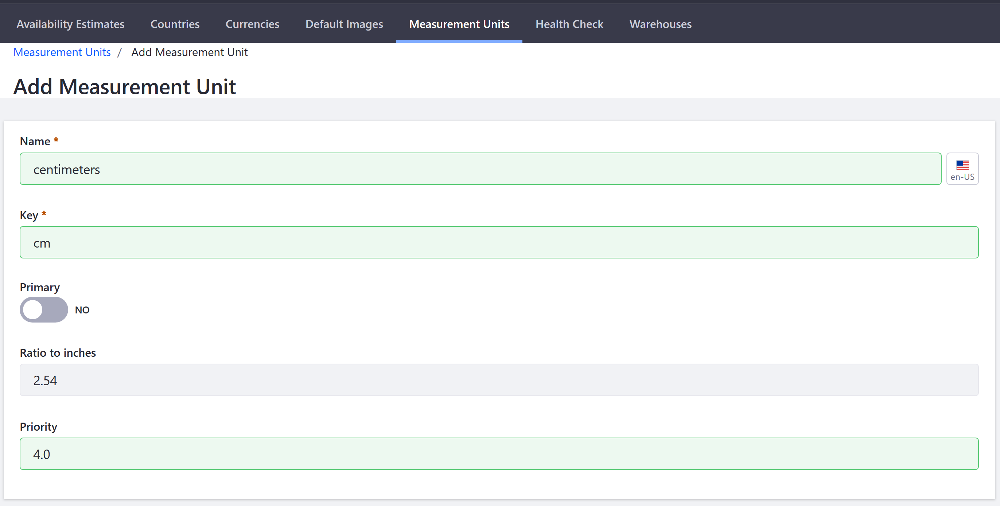

# Measurement Units

Liferay Commerce comes with a number of common measurement units already defined, but if you or your shipping provider use different units, you will need to change the default settings.

There are two measurement units defined in Liferay Commerce: 1) dimensions and 2) weight. For each measurement unit, a primary unit must be designated. In Liferay Commerce, _Primary Unit_ determines the system of measurement used in the store, as well as the default measurements displayed in the catalog. By default inches and pounds are the Primary Units for Dimension and Weight respectively. Whatever is set as the primary unit will be used by the catalog and by the variable-rate shipping method.

## Adding A New Measurement Unit

It may be necessary to add a new measurement unit; for example, centimeters is not listed as default measurement unit on the _Dimensions_ page. Likewise, the products shipped might be measured in a larger increment such as metric tons (tonnes) instead of kilograms.

To enter a new dimension measurement unit (for example, centimeters):

1. Navigate to the _Control Panel_ → _Commerce_ → _Settings_.
1. Click _Measurement Units_
1. Click the (+) button to add a new dimension.
1. Enter the following:
    * **Name**: centimeters
    * **Key**: cm
    * **Primary**: _No_
    * **Ratio to inches**: 2.54
    * **Priority**: 4.0

    

1. Click _Save_.

_Centimeters_ has been added to the list of dimensions.

**Note**: Although the key is generated based on the Name field, it is best practice to replace the key with the accepted short hand for that measurement unit such as **cm** instead.

## Additional Information

If you use the Carrier shipping method to integrate your shipping cost calculations with a shipping provider's system, you must have the provider's units defined as well. If the provider uses units that are different from your primary, the conversion is handled automatically.
