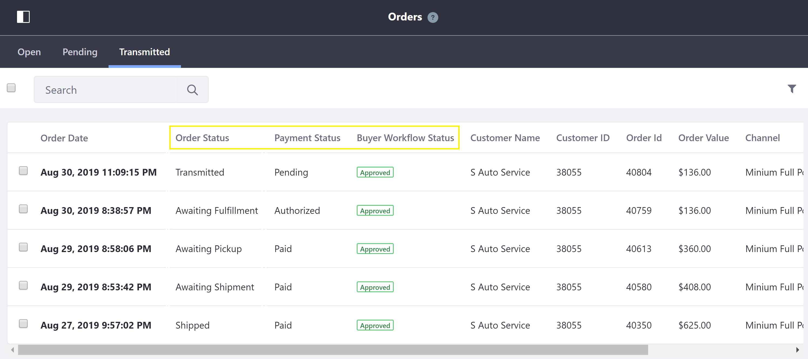
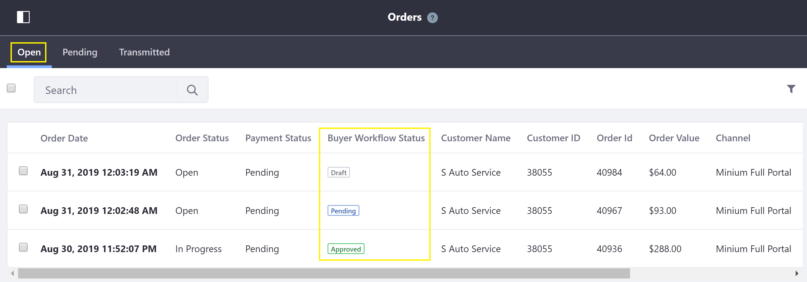

# Order Management Statuses

Every order in Liferay Commerce contains important [order information](../sales/order-information.md), including order management statuses.

This article gives a brief overview of the three order management status types – *Order Status*, *Payment Status*, and *Workflow Status* –  found on the [*Orders* Menu](../sales/orders-menu.md).

   

## Order Status

The *Order Status* gives more precise information about where an order is in the [order life cycle](../sales/order-life-cycle.md). Each order status appears on only one tab on the [*Orders* Menu](../sales/orders-menu.md): either the [*Open*](../orders-menu/README.md#open), [*Pending*](../orders-menu/README.md#pending), or [*Transmitted*](../orders-menu/README.md#transmitted) tab.

### Open Tab

There are two order statuses available on the *Open* tab: *Open* and *In Progress*.

   

| Order Status | Description |
| --- | --- |
| Open | One or more products have been added to the cart. The order may be in the checkout process (up to the *Order Summary* page). |
| In Progress | The order has advanced through the checkout process beyond the *Order Summary* page to the payment step. |

### Pending Tab

There is one order status available on the *Pending* tab: *To Transmit*.

   

| Order Status | Description |
| --- | --- |
| To Transmit | The order has been placed by the buyer, but not yet transmitted by the seller. |

### Transmitted Tab

There are twelve order statuses available on the *Transmitted* tab, as listed below.

   

| Order Status | Description |
| --- | --- |
| Transmitted | The order has been transmitted, with no additional status update. (This is the default order status of transmitted orders.) |
| Awaiting Fulfillment | The order has been transmitted and payment confirmed, but is not yet ready for shipment by the carrier. |
| Awaiting Pickup | The order has been prepared (and possibly shipped) and is awaiting pickup by the buyer from a seller-specified location. |
| Awaiting Shipment | The order is ready to ship, and is awaiting pickup and shipment by the carrier. |
| Partially Refunded | The seller refunded the buyer for less than the total price of the order. |
| Partially Shipped | Only a portion of the ordered products were shipped. |
| Refunded | The seller refunded the buyer for the total price of the order. |
| Shipped | The order was shipped, but not yet confirmed as received. |
| Completed | The order was shipped (or picked up) and confirmed as received; or the virtual products were paid for and are available for download. |
| Cancelled | The order was cancelled by the seller. |
| Declined | The order was shipped, but the buyer declined to receive it. |
| Disputed | The buyer initiated a dispute resolution for the payment transaction (such as via PayPal). |

## Payment Status

The *Payment Status* gives information about whether payment has been made and received for an order. On the *Pending* and *Transmitted* tabs on the [*Orders* Menu](../sales/orders-menu.md), there are three payment statuses available: *Authorized*, *Paid*, and *Pending*. (On the *Open* tab, an order's payment status is always *Pending*.)

   

| Payment Status | Description |
| --- | --- |
| Authorized | Payment has been authorized by the  financial institutions involved, and steps will be taken to deposit the funds into the seller's account. (This may be the case for online payment methods such as PayPal, or a credit card or debit card.) |
| Paid | Payment for the order has been received by the seller. |
| Pending | Payment for the order has not been received or authorized. (This may be the case for offline payment methods such as money orders and purchase orders, if the payment has not yet been received or checked, or the payment status has not been updated. It may also be the case for online payment methods such as PayPal, if the buyer stops the payment process.) |

## Workflow Status

The *Workflow Status* gives information about where an order is in one of the two [order workflows](../order-workflows/README.md). (../sales/orders-menu.md) it is found.)

### Open Tab

*Workflow Status* on the *Open* tab refers to the order's progress through the [*Approval Workflow*](../order-workflows/README.md#approval-workflow-buyer-side-cart-approval-only). For this order workflow, there are three workflow statuses available: *Draft*, *Pending*, and *Approved*.

   

| Workflow Status | Description |
| --- | --- |
| Draft | Products have been added to the cart, but the cart has not yet been submitted for review and approval by the buyer. |
| Pending | The cart (order) has been submitted for review and approval, but it has not yet been approved by the buyer. |
| Approved | The order has been reviewed and approved by the buyer, and the order may now proceed to checkout. |

### Pending Tab

*Workflow Status* on the *Pending* tab refers to the order's progress through the [*Transmission Workflow*](../order-workflows/README.md#transmission-workflow-seller-side-order-approval-only). For this order workflow, there are two workflow statuses available: *Pending* and *Approved*.

   

| Workflow Status | Description |
| --- | --- |
| Pending | The order has been placed, but it has not yet been approved by the seller. |
| Approved | The order has been reviewed and approved by the seller, and the order may now be transmitted. (Note: This workflow status appears also on the *Transmitted* tab.) |

## Additional Information

* [Orders Menu](../sales/orders-menu.md)
* [Order Information](../sales/order-information.md)
* [Order Life Cycle](../sales/order-life-cycle.md)
* [Order Workflows](../order-workflows/README.md)
* [Enabling or Disabling Order Workflows](../order-workflows/enabling-or-disabling-order-workflows/README.md)
* [Approving or Rejecting Orders in Order Workflows](../sales/approving-or-rejecting-orders-in-order-workflows.md)
