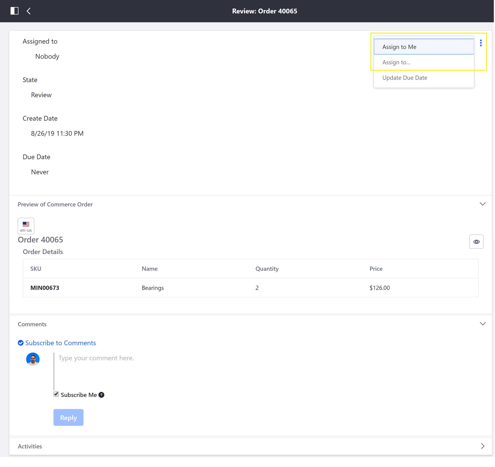
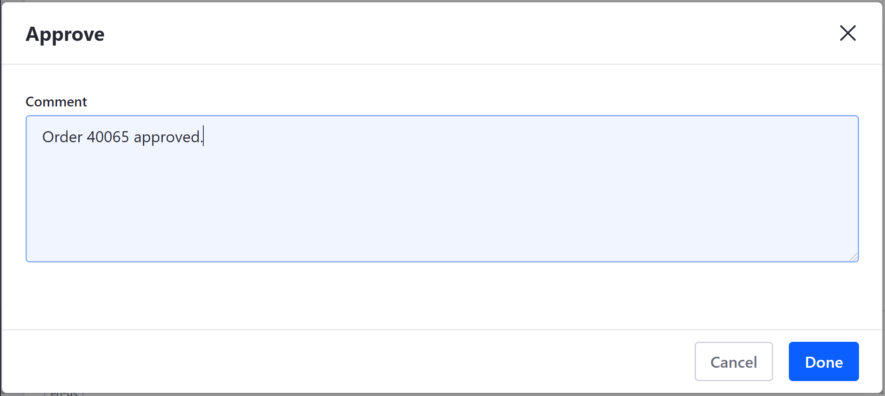

# Approving or Rejecting Orders in Order Workflows

[Order workflows](../order-workflows/README.md), when enabled, empower the buyer or seller to require internal prior approval for an order before it can be processed. This article documents how to approve or reject an order when *Approval Workflow* or *Transmission Workflow* is enabled with the *Single Approver (Version 1)* option.

## Approving or Rejecting an Order

Once the buyer has submitted his cart for pre-approval, or placed an order for seller-approval, the order can be approved or rejected by the appropriate user as follows:

1. Navigate to *User Administration* → *My Account* → *Notifications*.

   

1. Click on the order workflow notification.

   

1. Click the _3-dot icon_ in the upper-right corner → *Assign to Me*.

   

    > **Note:** Alternatively, click _Assign to..._ and select another user to review the Commerce Order.

1. Add a comment (optionally) and click *Done*.

1. Click the _3-dot icon_ in the upper-right corner → *Approve* (or *Reject*).

   

1. Add a comment (optionally) and click *Done*.

   

    The reviewed order is then displayed in _My Workflow Tasks_.

   

The order has been approved (or rejected). To review additional orders, return to the *Notifications* page and repeat the steps outlined above.

## Additional Information

* [Order Workflows](../README.md)
* [Enabling or Disabling Order Workflows](../enabling-or-disabling-order-workflows/README.md)
* [Order Life Cycle](../sales/order-life-cycle.md)
* [Orders Menu](../../orders-menu/README.md)
* Order Management Statuses
