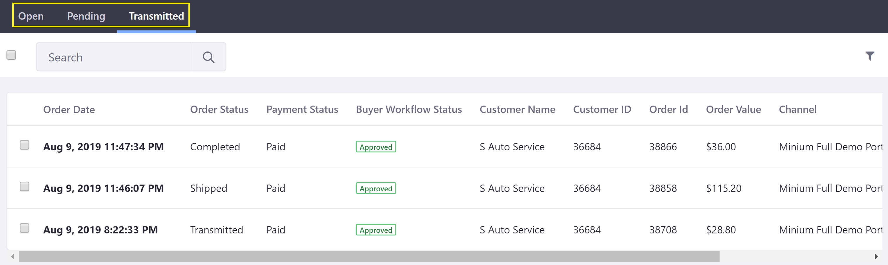

# Orders Menu

All orders in Liferay Commerce can be viewed and managed by an administrator in the _Orders_ menu. Here, orders are displayed in the _Open_, _Pending_, and _Transmitted_ tabs according to the order’s progress through the [order life cycle](../order-life-cycle/README.md).

   

This article gives an overview of the _Open_, _Pending_, and _Transmitted_ tabs.

## Open

In this tab, the order activity is exclusively on the buyer's side. A new order is created in the _Open_ tab when a buyer adds products to their cart. The order remains in this tab until the buyer places the order.

> **Note**: If _Approval Workflow_ is enabled, orders remain in the _Open_ tab until the workflow process has completed and the order is placed.

   

## Pending

The _Pending_ tab serves as a holding place for orders – this is helpful for business contexts where not all placed orders are immediately transmitted. When a buyer places an order, the order moves to the _Pending_ tab. Here, the seller can modify, cancel or transmit the order.

> **Note**: If _Transmission Workflow_ is enabled, orders remain in the _Pending_ tab throughout the workflow process, even if the seller rejects an order, sending it back to the buyer.

   

## Transmitted

In this tab, the order activity is exclusively on the seller's side. The seller transmits a _Pending_ order by changing the order status (manually or via automation) from the “_To Transmit_” status to any other order status. At this point, the order moves to the _Transmitted_ tab and, if configured,  is sent to an external system, such as Microsoft’s Dynamics GP, Oracle’s NetSuite, or SAP. The seller may then proceed with delivery of the ordered products to the buyer. Additional information may also be added to the order, such as an updated order status, shipping information and estimated arrival time.

   

## Additional Information

Order information in the *Orders* menu can also be presented to other users – particularly buyers – using the *Open Carts* widget (for orders on the *Open* tab) and the *Orders* widget (for orders on the *Pending* or *Transmitted* tabs). See [Pending Orders](../content/pending-orders.md) and [Placed Orders](../content/placed-orders.md) for details.

* [Order Life Cycle](../order-life-cycle/README.md)
* [Order Information](../order-information/README.md)
* [Order Workflows](../order-workflows/README.md)
* Order Management Statuses
* Advancing an Order to Transmitted
* Enabling Order Workflows
* Approving/Rejecting Orders in Order Workflows
