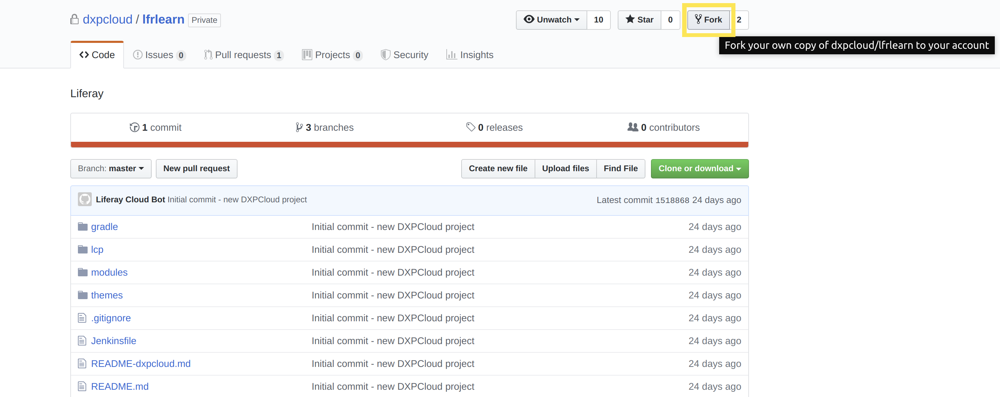
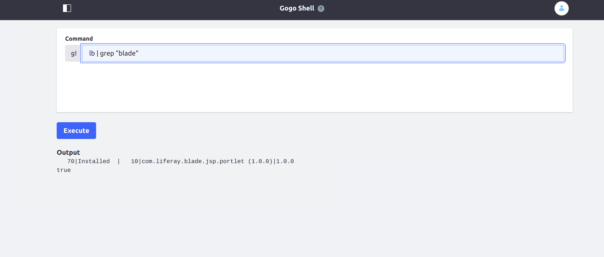

# Walking Through the Deployment Life Cycle

This article will walk you through the steps to deploy a sample module similarly to a normal deployment workflow. See [Overview of the DXP Cloud Development Workflow](./05-overview-of-the-dxp-cloud-deployment-workflow.md) for a more comprehensive explanation of the different steps of this workflow.

1. [Prerequisites](#prerequisites)
1. [Add the Sample to the Repository](#add-the-sample-to-the-repository)
1. [Deploy the Sample to the `dev` Environment](#deploy-the-sample-to-the-dev-environment)
1. [Verify the Sample Deployment](#verify-the-sample-deployment)

## Prerequisites

In order to get started, we will need the following:

* A sample module
* The Git repository set up and ready to go
* The DXP Cloud Command Line Interface installed

### Setting Up the Git Repository

First, fork the repository for your DXP Cloud project on GitHub:



> This will give you your own fork of the repository that you can push to in your own development. You can also use this to send pull requests to the upstream repository.

Next, clone your new fork of the repository on your local system:

```bash
git clone https://github.com/<github-user-name>/<project-name>.git
```

The repository will be copied into the current working directory and ready for use. See [Configuring Your GitHub Repository](./04-configuring-your-github-repository.md) for more information.

### Installing the Command Line Interface (CLI)

Setting up the CLI is optional if you do not wish to use the command line method of deployment. The recommended method of deployment is to use GitHub to invoke a CI build, rather than using the CLI.

Use this command to install the CLI:

```bash
curl https://cdn.liferay.cloud/cli/latest/lcp.sh -fsSL | bash
```

> **Note:** if you get a permissions error, try running the same command with `sudo`.

### Sample Module

A sample module compiled into a JAR will be necessary for this tutorial. You can proceed through this walkthrough using any module.

This tutorial will demonstrate using the "JSP Portlet" from the [Liferay Blade Samples](https://github.com/liferay/liferay-blade-samples). Follow these steps to get the same module shown in the tutorial:

First, clone the `liferay-blade-samples` repository:

```bash
git clone https://github.com/liferay/liferay-blade-samples.git
```

Next, navigate to the directory for the JSP Portlet:

```bash
cd liferay-blade-samples/liferay-workspace/apps/jsp-portlet
```

Finally, use the `gradlew` script from the root of the repository to compile the module:

```bash
../../../gradlew deploy
```

The module will be compiled into a JAR located in `liferay-blade-samples/liferay-workspace/bundles/osgi/modules`.

See [Configuring Your GitHub Repository](./04-configuring-your-github-repository.md) for steps on setting up the repository. See [Command Line Tool](../10-reference/03-command-line-tool.md) for more information on installing the CLI.

## Add the Sample to the Repository

Begin the deployment life cycle by adding your sample module into the Git repository. Add the JAR into the appropriate `deploy` folder within `lcp/liferay`. For this tutorial, choose the `dev` folder:

```bash
cp path-to-module/my-module my-repository-path/lcp/liferay/deploy/dev
```

## Deploy the Sample to the `dev` Environment

Deployment to DXP Cloud normally consists of committing the changes in Git, pushing them to GitHub, and finally deploying the build triggered in CI. However, you can also skip pushing your changes to GitHub by using the CLI if desired.

[Deploy from the DXP Cloud Console](#deploy-from-the-dxp-cloud-console)
[Deploy using the CLI](#deploy-using-the-cli)

> In general, pushing to GitHub and using the DXP Cloud console is recommended for deployments. 

### Deploy from the DXP Cloud Console

First, navigate to your repository, and create a new branch for your changes:

```bash
git checkout -b testing-branch
```

Next, add your new module to Git:

```bash
git add lcp/liferay/deploy
```

Commit to Git so that you can push your changes:

```bash
git commit -m "Testing JAR"
```

Then, push your branch to your fork of the repository:

```bash
git push origin testing-branch
```


Once you have sent the pull request to the upstream repository, the CI service will automatically begin a build that you will be able to use for your deployment.

Navigate to the DXP Cloud console, and then go to the `Builds` tab for the desired environment. The option to deploy the build will appear when the build completes successfully; click the three dots to the right side of the build to see the option.


Click "Deploy Build to..." for any successful build to deploy to the environment of your choice. Normally, a new build will first be deployed to the `dev` environment. However, developers can directly deploy to any environment as long as they have permissions to do so.


### Deploy Using the CLI

Local development should be done using a local instance of DXP, rather than developing within DXP Cloud; see [Introduction to Liferay Development](https://help.liferay.com/hc/en-us/articles/360017884172-Introduction-to-Liferay-Development) for help with getting started developing in Liferay DXP. However, you can still use the CLI to directly deploy your services if desired.

Open the `gradle.properties` at the root of your repository, and find properties for the Docker image versions for each of your services, like the following:

```
liferay.workspace.lcp.backup.image=liferaycloud/backup:3.2.1
liferay.workspace.lcp.database.image=liferaycloud/database:3.2.1
liferay.workspace.lcp.search.image=liferaycloud/elasticsearch:6.1.4-3.0.3
liferay.workspace.lcp.liferay.image=liferaycloud/liferay-dxp:7.2.10-ga1-3.0.10
liferay.workspace.lcp.webserver.image=liferaycloud/nginx:1.14.2-3.1.1
liferay.workspace.lcp.jenkins.image=liferaycloud/jenkins:2.176.1-3.1.1
```

For each of these properties, copy the value and use it to replace the placeholder value for the `image` property in the corresponding service's `LCP.json` file. This will allow the CLI to use the correct Docker images when it searches within the `lcp` directory.

> **Note:** the `liferay.workspace.lcp.jenkins.image` property corresponds to the `ci` service.

For example, use the value from the `liferay.workspace.lcp.search.image` property as the new value in `lcp/search/LCP.json` for this line:

```
"image": "@liferay.workspace.lcp.search.image@",
```

To start with deploying the module, first navigate with your command prompt to the `lcp` directory. This is necessary to allow the CLI to traverse this directory for your changes.

```bash
cd lcp
```

Next, to start using the CLI, log in:

```bash
lcp login
```

Answer `y` at the prompt to open a browser tab to authenticate into DXP Cloud. The CLI will wait for authentication from the browser to complete the command.

Finally, deploy the newly added module by running:

```bash
lcp deploy --project=<project-name> --environment=dev
```


Once the command finishes running, the module will be copied to the chosen environment. The affected services will need some time to restart and apply the new module to the Docker images.

## Verify the Sample Deployment

Verify that the module was deployed in the `dev` environment by navigating to your Liferay DXP instance.

### Login Credentials

You will first need the customer user name and password to access the web server; these credentials are shared between all environments.

From the DXP Cloud console, navigate to the `infra` environment → CI service → Environment Variables tab (or go directly to `https://console.liferay.cloud/projects/<project-name>-infra/services/ci/environment-variables`).

From this screen, you can check the `JENKINS_CUSTOMER_USER_NAME` and `JENKINS_CUSTOMER_PASSWORD` variables for the login credentials for your web server:


### Accessing the Web Server

One or more services may be unavailable while the deployment is in progress; this can temporarily prevent you from accessing the web server. You may need to wait for some time before all of the services are ready. Go to `https://console.liferay.cloud/projects/<project-name>-dev/services` to see the status of your services.

When the `webserver` service is ready to use, navigate to it, and then click on the link on the word "webserver" near the top of the page. This will take you to your running Liferay DXP instance through the web server.


> **Note:** you can also go directly to `https://webserver-<project-name>-dev.lfr.cloud/` to get to the same location.

You can use the Gogo shell to easily confirm whether your module was deployed. Navigate to the Control Panel → Configuration → Gogo Shell. From here, use this command to check whether the module has been deployed:

`lb | grep "my.module.name"`



Once you have verified the deployment was successful, you will have completed this tutorial.

## Additional Information

* [Deployment]()
* [Configuring Your GitHub Repository](./04-configuring-your-github-repository.md)
* [Environments](../05-build-and-deploy/02-environments.md)
* [Overview of the DXP Cloud Development Workflow](./05-overview-of-the-dxp-cloud-development-workflow.md)
* [Command-Line Tool](../10-reference/03-command-line-tool.md)