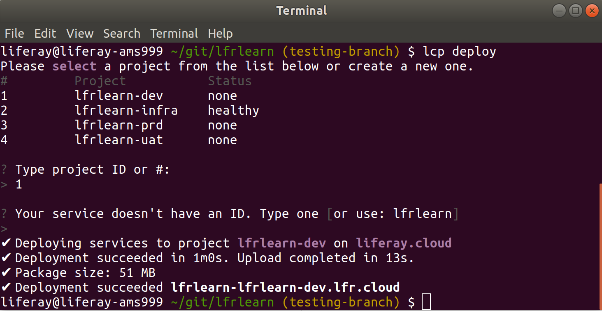
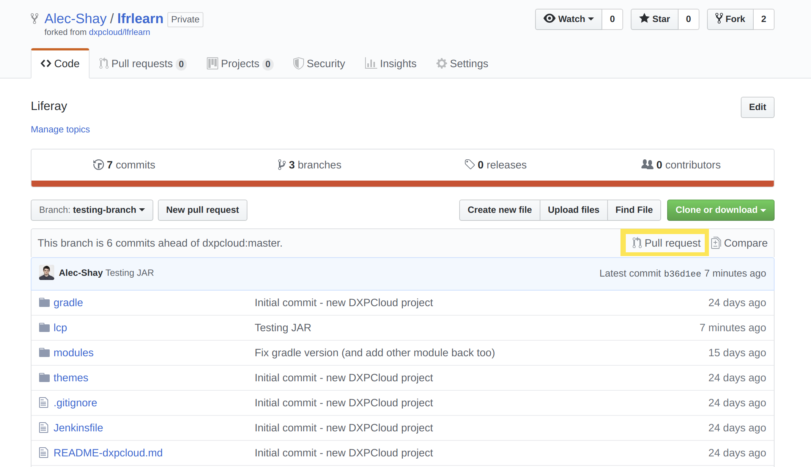
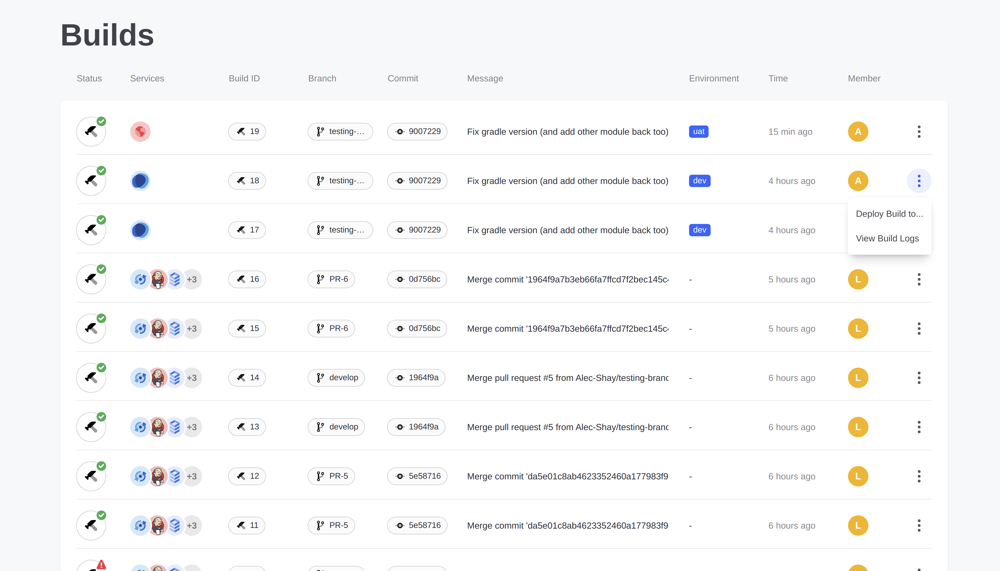

# Walking Through the Development Life Cycle

This article will walk you through the steps to deploy a sample module similarly to a normal development workflow. See [Overview of the DXP Cloud Development Workflow](./05-overview-of-the-dxp-cloud-development-workflow.md) for a more comprehensive explanation of the different steps of this workflow.

1. [Prerequisites](#prerequisites)
1. [Add the Sample to the Repository](#add-the-sample-to-the-repository)
1. [Deploy the Sample to the `dev` Environment](#deploy-the-sample-to-the-dev-environment)
1. [Test the Sample Deployment](#test-the-sample-deployment)
1. [Deploy the Sample to the `uat` Environment](#deploy-the-sample-to-the-uat-environment)
1. [Review the Sample Deployment](#review-the-sample-deployment)

## Prerequisites

In order to get started, we will need the following:

* A sample module to deploy
* The Git repository set up and ready to go
* The DXP Cloud Command Line Interface installed

The source code for a sample module will be necessary for this tutorial. You can use any module, as long as it can be easily tested after deploying. The [Liferay Blade Samples](https://github.com/liferay/liferay-blade-samples) are a good source for some simple modules; you can clone this repository and copy one of the app modules for something to quickly use.

See [Configuring Your GitHub Repository](./04-configuring-your-github-repository.md) for steps on setting up the repository. See [Command Line Tool](../10-reference/03-command-line-tool.md) for more information on installing the CLI.

## Add the Sample to the Repository

Begin the deployment life cycle by adding your sample module into the Git repository. Add the source code for the module into the `modules` folder at the root of the repository:

```bash
cp -R my-module-path/my-module my-repository-path/modules
```

## Deploy the Sample to the `dev` Environment

For this example workflow, use the CLI to deploy the sample module to the `dev` environment.

First, log in to the CLI:

```bash
lcp login
```

Answer `y` at the prompt to open a browser tab to authenticate into DXP Cloud. The CLI will wait for authentication from the browser to complete the command.

Next, deploy the services using any changes made in the local repository:

```bash
lcp deploy
```

Choose an environment to deploy to when prompted in the CLI. You may also be prompted to enter an ID for the project.



Once the command finishes running, the services will be successfully deployed to the chosen environment.

## Test the Sample Deployment

Test the deployment in the `dev` environment by navigating to your Liferay instance. Visit the DXP Cloud console for your project and navigate to the `Services` page (or go directly to `https://console.liferay.cloud/projects/<project-name>-dev/services`). You may see that one or more services are unavailable while the deployment is in progress. It may take some time before all of the services are ready.

When the `webserver` service is finally ready to use, navigate to it, and then click on the link on the word "webserver" near the top of the page. This will take you to your running Liferay DXP instance to confirm the module was deployed.



## Deploy the Sample to the `uat` Environment

Rather than use the CLI to deploy to the `uat` environment, go back to the DXP Cloud console to use the build in CI that has already triggered from the previous steps.

> **Note:** a realistic workflow may also include sending a pull request with the committed changes to the repository on GitHub. That pull request would then trigger CI testing that could be used for deployment. This tutorial will skip sending a pull request, since it is meant to be completed without a review process.

Navigate to the `Builds` tab for the desired environment. The option to deploy the build will appear when the tests complete successfully.


Click "Deploy Build to..." for any successful build to deploy to the environment of your choice. Normally, a new build will first be deployed to the `dev` environment. However, developers can directly deploy to any environment as long as they have permissions to do so.



## Review the Sample Deployment

Navigate back to the DXP Cloud console, and this time navigate to the `uat` environment. Once the `webserver` service is up and running again, you can navigate to your DXP instance by again clicking the "webserver" link through this service.

Once you have verified the deployment was successful, you will have completed this tutorial.

## Additional Information

* [Configuring Your GitHub Repository]()
* [Environments](../05-build-and-deploy/02-environments.md)
* [Overview of the DXP Cloud Development Workflow](./05-overview-of-the-dxp-cloud-development-workflow.md)
* [Command-Line Tool](../10-reference/03-command-line-tool.md)