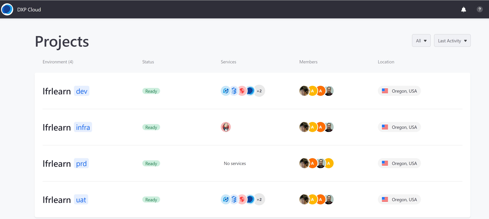

# Using SSO with DXP Cloud

Customers may use their SAML 2.0 compliant Single Sign-On Identity Providers to authenticate users to the DXP Cloud platform. This document will detail the process to enable this integration.

Using SAML to execute SSO requires three agents, the Client, the Service Provider (SP), and the Identity Provider (IdP). When the client tries to connect to the Service Provider, the Service Provider will redirect the client to the Identity Provider. After the client is authenticated by the Identity Provider, the Identity Provider will grant the access to the client’s credentials to the Service Provider.

In this scenario, DXP Cloud functions as the Service Provider; the customer trying to log into DXP Cloud is the client; and the Identity Provider is an enterprise directory solution managed by the customer.

## Enabling SSO for a DXP Cloud Project

To enable SSO for your DXP Cloud project the following steps need to be taken:

1. [Provide IdP Metadata to the DXP Cloud Team](#provide-identity-provider-metadata-to-the-dxp-cloud-team)
1. [DXP Cloud Team Imports Provided IdP Data and Provides Service Provider (SP) Metadata](#dxp-cloud-team-imports-provided-idp-data-and-provides-service-provider-metadata)
1. [Import SP Metadata Provided by the Liferay DXP Cloud Team](#import-sp-metadata-provided-by-the-liferay-dxp-cloud-team)

### Provide Identity Provider Metadata to the DXP Cloud Team

Client who wish to enable SSO for their DXP Cloud project will need to provide their **IdP** system's metadata which must include the following information:

| Field | Description |
| --- | --- |
| IdP Issuer | The name of the identity issuer; usually the `EntityID` attribute of the `EntityDescriptor` Metadata |
| IdP Single Sign-On URL | Request endpoint that will receive the SAML Authentication Request (example: <http://adfs.customer.com/saml/sso)> |
| IdP Signature Certificate | Public Key Certificate of the IdP to the SAML message and assertion signatures |
| IdP Single Sign-On HTTP Method (Request Binding) | The HTTP method supported by the customer’s Identity Provider to receive the Authentication Requests; the only valid answers are `POST` (the default) and `GET` |
| Sign Requests | Set to `TRUE` if the SAML requests sent to the Customer’s Identity Provider should be signed; otherwise set to `FALSE` |
| Request Signature Algorithm (RSA) | If the `Sign Requests` is set to `TRUE`, provide the algorithm used to sign the requests. At the moment we support SHA-1 (not recommended) and SHA-256. If the request signing is disabled, this configuration is unnecessary. |

#### ADFS-Specific Information

Clients using Microsoft ADFS should pay attention to the following settings which are required to setup SSO using SAML:

| Field | Description |
| --- | --- |
| IdP Issuer URI |Located in the General tab's _Federation Service identifier_ and has a default value of <http://domain/adfs/services/trust> |
| IdP Single Sign-On URL | Default setting is `/adfs/ls`. Example: <http://adfs.example.com/adfs/ls/> |
| IdP Signing Certificate | A DER encoded binary X.509 certificate file |

Once the IdP metadata has been generated, [open a ticket with the DXP Cloud team](https://help.liferay.com/hc/). IdP metadata can be transmitted in the form of either an XML file or a URL endpoint (<https://localhost:8080/c/saml/metadata> is a basic example).

### DXP Cloud Team Imports Provided IdP Data and Provides Service Provider Metadata

The DXP Cloud team will then provide the following SP metadata values to the client:

| Field | Description |
| --- | --- |
| Assertion Consumer Service (ACS) URL | The SAML response received by DXP Cloud. This will always be an address server from <https://auth.liferay.cloud> |
| Audience URL | The URL Liferay Cloud used to access the customer’s Identity Provider |

### Import SP Metadata Provided by the Liferay DXP Cloud Team

Once the SP metadata has been received from the DXP Cloud team, enter the SP metadata values in into the IdP.

## Using SSO

To log into DXP Cloud using SSO:

1. Navigate to <https://console.liferay.cloud/login>.
1. Click _Login via SSO_.

   

1. Enter the **Company Name** in the _Organization ID_ field.
1. Click _Continue_.
1. Enter the **Email Address** in the _Email Address_ field. This must be the same email address stored in the company's database or directory service (such as an LDAP or ADFS).
1. Enter the **Password** in the _Password_ field. This must be the same password associated with the email address stored in the company's database or directory service.
1. Click _Log in_.

Once logged in, the user should see all of his or her projects and environments.

