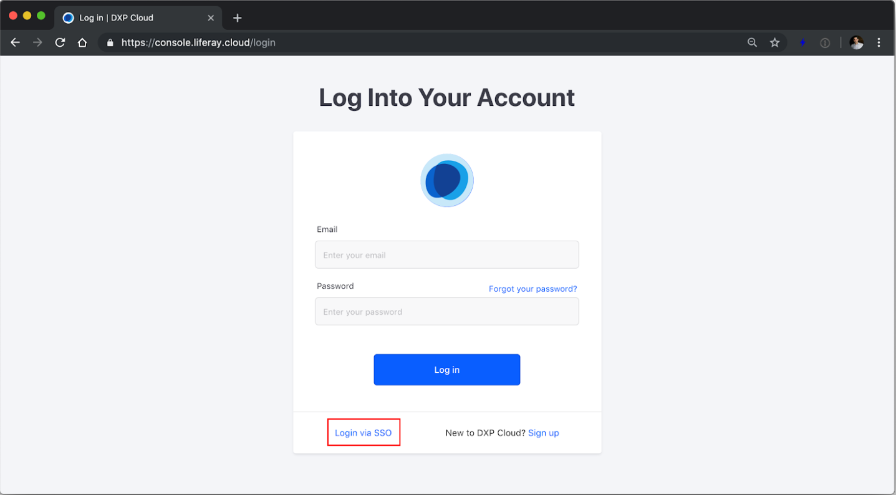

# Login Using SSO

## Introduction

DXP Cloud provides a way for customers to connect their enterprise Single Sign-On Identity Provider to the DXP Cloud platform, using the SAML 2.0 industry standard. This document will detail the process using the SAML 2.0 protocol.

Using SAML to execute SSO requires three agents, the Client, the Service Provider (SP), and the Identity Provider (IdP). When the client tries to connect to the Service Provider, the Service Provider will redirect the client to the Identity Provider. After the client is authenticated by the Identity Provider, the Identity Provider will grant the access to the client’s credentials to the Service Provider.

In this scenario, DXP Cloud is configured as the Service Provider; the customer trying to log into DXP Cloud is the client; and the Identity Provider is an enterprise directory solution managed by the customer.

## SSO Configurations

This article documents the required steps before a customer can use the Single Sign-On (SSO) features to log into DXP Cloud. Note: Using the SSO feature is **optional**.

To enable SSO, this is a multi-step process undertaken by both the DXP Cloud team and the customer. The customer is responsible for generating the IdP values and DXP Cloud is responsible for generating the SP metadata values.

### Generating the Identity Provider (IdP)

The _customer_ needs to generate the **IdP** metadata which must include the following information:

| Field | Description |
| --- | --- |
| IdP Issuer | The name of the identity issuer; usually the `EntityID` attribute of the `EntityDescriptor` Metadata |
| IdP Single Sign-On URL | Request endpoint that will receive the SAML Authentication Request (example: <http://adfs.customer.com/saml/sso)> |
| IdP Signature Certificate | Public Key Certificate of the IdP to the SAML message and assertion signatures |
| IdP Single Sign-On HTTP Method (Request Binding) | The HTTP method supported by the customer’s Identity Provider to receive the Authentication Requests; the only valid answers are `POST` (the default) and `GET` |
| Sign Requests | Set to `TRUE` if the SAML requests sent to the Customer’s Identity Provider should be signed; otherwise set to `FALSE` |
| Request Signature Algorithm (RSA) | If the `Sign Requests` is set to `TRUE`, provide the algorithm used to sign the requests. At the moment we support SHA-1 (not recommended) and SHA-256. If the request signing is disabled, this configuration is unnecessary. |

### ADFS-Specific Information

Subscribers using Microsoft ADFS should pay attention to the following settings which are required to setup SSO using SAML:

| Field | Description |
| --- | --- |
| IdP Issuer URI |Located in the General tab's _Federation Service identifier_ and has a default value of <http://domain/adfs/services/trust> |
| IdP Single Sign-On URL | Default setting is `/adfs/ls`. Example: <http://adfs.example.com/adfs/ls/> |
| IdP Signing Certificate | A DER encoded binary X.509 certificate file |

For more information about configuring ADFS as an IdP, see [Configuring ADFS as an Identity Provider](https://docs.pivotal.io/pivotalcf/2-3/opsguide/adfs-sso-configuration.html).

Once the IdP metadata has been generated, forward this to the DXP Cloud team. IdP metadata could be transmitted in the form of either an XML file or a URL endpoint (<https://localhost:8080/c/saml/metadata> is a basic example).

### The Service Provider (SP)

The DXP Cloud team will do two things:

1. Generate the **SP** metadata.
1. Import the IdP values into DXP Cloud.

The SP metadata values include the following:

| Field | Description |
| --- | --- |
| Assertion Consumer Service (ACS) URL | The SAML response received by DXP Cloud. This will always be an address server from <https://auth.liferay.cloud> |
| Audience URL | The URL Liferay Cloud used to access the customer’s Identity Provider |

The DXP Cloud team will then transmit the SP metadata to the customer.

### Final Steps

Once the customer has received the SP metadata from the DXP Cloud team, enter the SP metadata values in their IdP.

## Using SSO

Once the IdP and the SP have been connected, it is a best practice to verify that the users in the directory services (IdP) matches with those in the SP. Otherwise, SSO will fail.

To log into DXP Cloud using SSO:

1. Navigate to <https://console.liferay.cloud/login>.
1. Click _Login via SSO_.

   

1. Enter the **Company Name** in the _Organization ID_ field.
1. Click _Continue_.
1. Enter the **Email Address** in the _Email Address_ field. This must be the same email address stored in the company's database or directory service (such as an LDAP or ADFS).
1. Enter the **Password** in the _Password_ field. This must be the same password associated with the email address stored in the company's database or directory service.
1. Click _Log in_.

Once logged in, the user should see all of his or her projects and environments.

## Additional Information

* [Using MS ADFS & Liferay SAML Integration](https://help.liferay.com/hc/en-us/articles/360025553792-Using-MS-ADFS-Liferay-SAML-Integration-)
