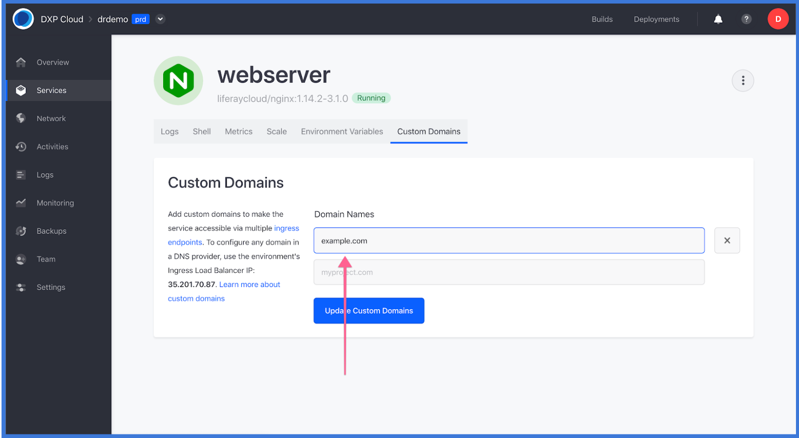

# Disaster Recovery

## Introduction

DXP Cloud provides two ways for customers to take advantage of the Disaster Recovery (DR) procedure in the case of major incidents.

* **Automatic Disaster Recovery**: DXP Cloud performs automatic disaster recovery protocols by replicating services between three Availability Zones in different geographic locations within the same Region. In case any of the Availability Zones become unavailable, the Load Balancer will automatically route to the remaining Availability Zones without requiring DNS changes on the customer side. In this situation, _no action is required from the customer during an incident_.

* **Cross-Region Disaster Recovery**: The Disaster Recovery procedure as explained in this document is only necessary when there is a compromise in all three Availability Zones in the same region at the same time.

This article documents the steps required to help a customer recover data manually during a _cross-region disaster_.

## Roadmap

* Initial Setup
* During the Incident
* Post-Incident Recovery Steps

## Initial Setup

Liferay offers a fifth DXP Cloud environment to manage a _cross region_ disaster. In this scenario, assume that a production environment is stored in the *eu-west-2* region and that suddenly this region is compromised. To prevent downtime and data loss on the production environment, this environment has to be shifted to outside the region such as *us-west1*. This fifth Disaster Recovery (shortened to *DR*) environment thus serves as a backup to store new user data generated during the incident.

DXP Cloud customers wishing to use this Disaster Recovery environment must purchase this additional environment first by contacting their sales representatives. Liferay DXP Cloud engineers will create the disaster recovery environment. This new environment is listed with the other available environments (dev, infra, UAT, and prod).

### Verify VPN Settings in the DR environment

Communications between the *DR* environment and production may go through a VPN. To ensure the two environments are connected:

1. Navigate to _Settings_ in the left menu.
1. In the _VPN_ section, enter the following:
    * **VPN Type**: OpenVPN
    * **Server Address**: (server address)
    * **Account Name**: (administrator's email address)
    * **Password**: (administrator's password)
    * **Certificate**: (Certificate code)
    * **Forwarding IP**: (IP address)
    * **Forwarding Port**: (port number)
    * **Local Hostname**: (VPN)
    * **Local Port**: (local port number)
1. Click _Connect VPN_.

### Deploy the Latest Stable Build from Production to the DR environment

Once the environment has been created, it must include the most recent stable build.

1. Click _Builds_ in the top navigation bar.
1. Click the _3-dot_ icon then _Deploy Build to..._ next to the most recent build.

    

1. Select the _dr_ environment from the dropdown menu.

    

1. Click _Deploy Build_.

## During the Incident

Continuing the example above, the production environment hosted in the *eu-west-2* region is scheduled to be backed up hourly at 2:00 PM local time and that the region is compromised at 2:30 PM local time. Because no backups have been generated in the intervening half hour, it is necessary to restore a backup of database and documents from the Production environment to the Disaster Recovery environment. The last stable environment is the version created at 2:00 PM.

### Restore the Latest Stable Environment

1. Navigate to _Backups_ on the **DR** environment.
1. Click the _3-dot_ icon then _Restore_ from the most recent backup.

   

### Configure Web Server custom domain in the Production environment

The custom domain of the *DR* environment should match that of the original production environment. To update the custom domain in the *DR* environment:

1. Navigate to _Services_ on the left menu.
1. Click on _webserver_ in the list of Services.
1. Click the _Custom Domains_ tab.

1. Remove the custom domain from the Production environment.
1. Update the DNS records. For more information, see the [Custom Domain](https://help.liferay.com/hc/en-us/articles/360032856292) article.
1. Click _Update Custom Domain_.

## Post-Incident Recovery Steps

Once the region has been recovered and the incident is over, there are some necessary steps if the production environment is to be shifted back to the original region (back to *eu-west2* in this example). To do so, perform a manual backup since new user data has been generated during the period the DR environment served as the production environment.

### Create a Manual Backup in the DR environment

During the incident, new data has been generated on the *DR* environment. This needs to be imported into the original production environment; therefore, a backup is created in the *DR* environment.

1. Navigate to _Backups_ on the **DR** environment.
1. Click _Backup Now_.

    

### Restore the Manual Backup from DR to Production environment

1. Navigate to _Backups_ on the **DR** environment.
1. Click the _3-dot_ icon from the most recent back up then click _Restore_.

    

1. Select the production environment.

    

1. Click _Deploy Build_.

### Update the Web Server Custom Domain in the Production environment

Because the custom domain was updated in the *DR* environment, the settings have to be updated again so that all traffic is redirected back to the correct domain.

1. Navigate to _Services_ on the left menu.
1. Click on _webserver_ in the list of Services.
1. Click the _Custom Domains_ tab.

1. Remove the custom domain from the Production environment.
1. Update the DNS records. For more information, see the [Custom Domain](https://help.liferay.com/hc/en-us/articles/360032856292) article.
1. Click _Update Custom Domain_.

## Additional Information

Below is a diagram of how the restoration process from production to the disaster recovery environment looks like:

