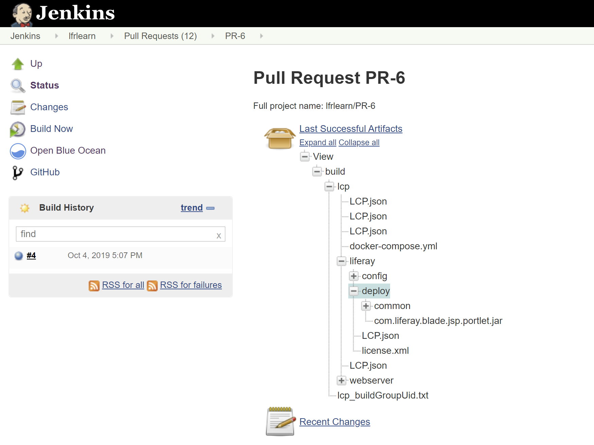

# Walking Through the Deployment Life Cycle

This article will walk you through the steps to deploy a sample module similarly to a normal deployment workflow. See [Overview of the DXP Cloud Development Workflow](./overview-of-the-dxp-cloud-deployment-workflow.md) for a more comprehensive explanation of the different steps of this workflow.

1. [Prerequisites](#prerequisites)
1. [Add the Sample to the Repository](#add-the-sample-to-the-repository)
1. [Deploy the Sample to the `dev` Environment](#deploy-the-sample-to-the-dev-environment)
1. [Verify the Sample Deployment](#verify-the-sample-deployment)

## Prerequisites

In order to get started, we will need the following:

* A sample module
* A configured DXP Cloud Git repository

### Setting Up the Git Repository

You must have your GitHub repository configured. See [Configuring Your GitHub Repository](../getting-started/configuring-your-github-repository.md) for more information on setting up a DXP Cloud repository.

### Sample Module

A sample module compiled into a JAR will be necessary for this tutorial. You can proceed through this walkthrough using any module.

Develop or use an existing module to deploy in this tutorial. This tutorial will use the sample "JSP Portlet" from the [Liferay Blade Samples](https://github.com/liferay/liferay-blade-samples) repository.

## Add the Sample to the Repository

Begin the deployment life cycle by adding your sample module into the Git repository. Add the JAR to the appropriate `deploy` folder within `lcp/liferay`. For this tutorial, choose the `dev` folder:

```bash
cp path-to-module/my-module my-repository-path/lcp/liferay/deploy/dev
```

## Deploy the Sample to the `dev` Environment

Deployment to DXP Cloud normally consists of pushing the changes in Git, the GitHub webhook triggering a build with the DXP Cloud CI service, and finally deploying the successful build. However, you can also skip pushing your changes to GitHub by using the CLI if desired.

> In general, pushing to GitHub and using the DXP Cloud Management Console is recommended for deployments.

### Commit the Sample in Git

Add and commit the sample module to your repository.

```bash
git commit -am "Add sample module"
```

Then, push the branch to your GitHub repository origin:

```bash
git push origin testing-branch
```

### Trigger a Build with the Sample

Next, send a pull request to the upstream repository. The CI service will automatically begin a build that you will be able to use for your deployment.

First, navigate to your repository, and create a new pull request for your changes:


Once you have sent the pull request to the upstream repository, the CI service will automatically begin a build that you will be able to use for your deployment.



> You may view triggered builds in the Jenkins [CI service]() by visiting `https://ci-<project>-<environment>.lfr.cloud`.

### Deploy the Build to `dev` from the DXP Cloud Management Console

Navigate to the DXP Cloud Management Console, and then go to the `Builds` tab for the desired environment. The option to deploy the build will appear when the build completes successfully; click the three dots to the right side of the build to see the option.


Click "Deploy Build to..." for any successful build to deploy to the environment of your choice. Normally, a new build will first be deployed to the `dev` environment. However, developers can directly deploy to any environment as long as they have permissions to do so.


### Deploy Using the CLI

Developers may use the DXP Cloud CLI tool to directly deploy to services if desired.

First, ensure that you have the DXP Cloud CLI installed:

```bash
lcp version
```

```bash
Liferay Cloud Platform CLI version 2.1.2 linux/amd64
Build commit: 59e244b342d7b119f8e77eb94c6486f8049ca2b3
Build time: Wed Jul 10 01:59:00 UTC 2019
```

If not, see the [Command Line Tool](../reference/command-line-tool.md) article for more information about installation and usage.

Open the `gradle.properties` at the root of your repository, and find properties for the Docker image versions for each of your services, like the following:

```properties
liferay.workspace.lcp.backup.image=liferaycloud/backup:3.2.1
liferay.workspace.lcp.database.image=liferaycloud/database:3.2.1
liferay.workspace.lcp.search.image=liferaycloud/elasticsearch:6.1.4-3.0.3
liferay.workspace.lcp.liferay.image=liferaycloud/liferay-dxp:7.2.10-ga1-3.0.10
liferay.workspace.lcp.webserver.image=liferaycloud/nginx:1.14.2-3.1.1
liferay.workspace.lcp.jenkins.image=liferaycloud/jenkins:2.176.1-3.1.1
```

For each of these properties, copy the value and use it to replace the placeholder value for the `image` property in the corresponding service's `LCP.json` file. This will allow the CLI to use the correct Docker images when it searches within the `lcp` directory.

> **Note:** the `liferay.workspace.lcp.jenkins.image` property corresponds to the `ci` service.

For example, use the value from the `liferay.workspace.lcp.search.image` property as the new value in `lcp/search/LCP.json` for this line:

```properties
"image": "@liferay.workspace.lcp.search.image@",
```

To begin deploying the module, first navigate with your command prompt to the `lcp` directory. This is necessary to allow the CLI to traverse this directory for your changes.

```bash
cd lcp
```

```bash
lcp deploy --project=<project-name> --environment=dev
```


Once the command finishes running, the module will be copied to the chosen environment. The affected services will need some time to restart and apply the new module to the Docker images.

## Verify the Sample Deployment

Verify that the module was deployed in the `dev` environment by navigating to your Liferay DXP instance.

### Login Credentials

You will first need the customer user name and password to access the web server; these credentials are shared between all environments.

From the DXP Cloud Management Console, navigate to the `infra` environment → CI service → Environment Variables tab (or go directly to `https://console.liferay.cloud/projects/<project-name>-infra/services/ci/environment-variables`).

From this screen, you can check the `JENKINS_CUSTOMER_USER_NAME` and `JENKINS_CUSTOMER_PASSWORD` variables for the login credentials for your web server:


### Accessing the Web Server

Go to `https://console.liferay.cloud/projects/<project-name>-dev/services` to see the status of your services.

When the `webserver` service is ready to use, navigate to it, and then click on the link on the word "webserver" near the top of the page. This will take you to your running Liferay DXP instance through the web server.


> **Note:** you can also go directly to `https://webserver-<project-name>-<environment>.lfr.cloud/` to get to the same location.

You can use the Gogo shell to easily confirm whether your module was deployed. Navigate to the Control Panel → Configuration → Gogo Shell. From here, use this command to check whether the module has been deployed:

`lb | grep "my.module.name"`


Once you have verified the deployment was successful, you will have completed this tutorial.

## Additional Information

* [Deployment]()
* [Configuring Your GitHub Repository](../getting-started/configuring-your-github-repository.md)
* [Environments](../build-and-deploy/environments.md)
* [Overview of the DXP Cloud Development Workflow](./overview-of-the-dxp-cloud-development-workflow.md)
* [Starting Module Development](https://help.liferay.com/hc/en-us/articles/360017884192-Starting-Module-Development)
* [Command-Line Tool](../reference/command-line-tool.md)
