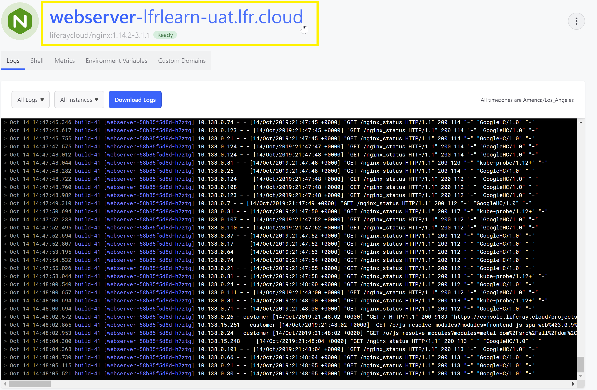
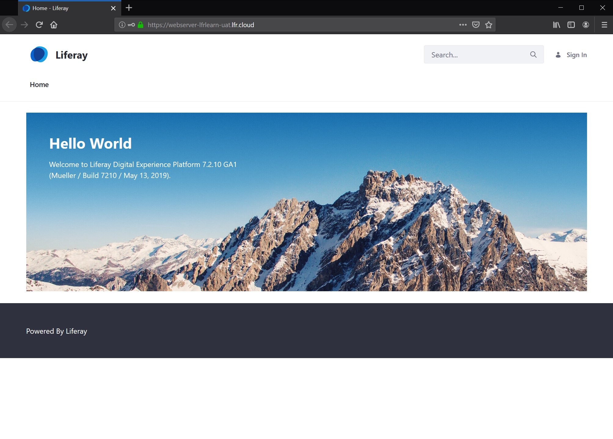

# Logging into Your DXP Cloud Services

By default, login is required to directly access the web interfaces for the DXP and Infrastructure services. Login credentials for these services are typically provided in an initial onboarding email - but may be located in the DXP Cloud Management Console if needed.

## Locating Login Credentials

1. Navigate to the _infra_ environment.
1. Click _Services_ in the left menu.
1. Select the _ci_ service.
1. Click the _Environment Variables_ tab.
1. Click _show_ icon next to `JENKINS_CUSTOMER_PASSWWORD` to retrieve the password.
1. Click _show_ icon next to `JENKINS_CUSTOMER_USER_NAME` to retrieve the user name.

## Logging In

1. Navigate to the environment where the _webserver_ service is located.
1. Click the _webserver_ logo at the top of the page.

    

1. Enter the DXP Cloud Jenkins user name and password when prompted.

    

1. This will redirect the user to the Liferay DXP 7.x instance (in this example, Liferay DXP 7.2 GA1).

    

Similar steps may be followed to access the Jenkins CI web interface.

## Additional Information

* [Introduction to the DXP Service](../using-the-liferay-dxp-service/introduction-to-the-liferay-dxp-service.md)
* [Continuous Integration](../build-and-deploy/continuous-integration.md)
* [Web Server Service](../platform-services/web-server-service.md)
