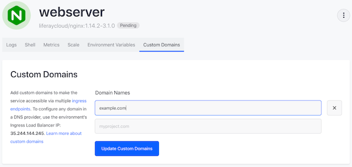
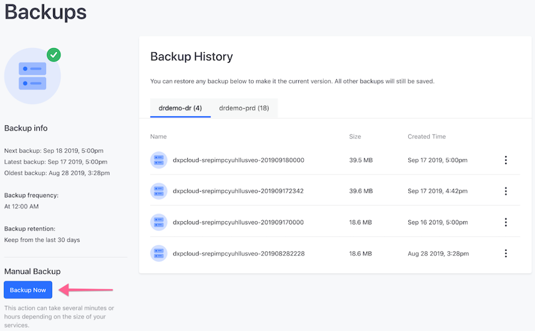
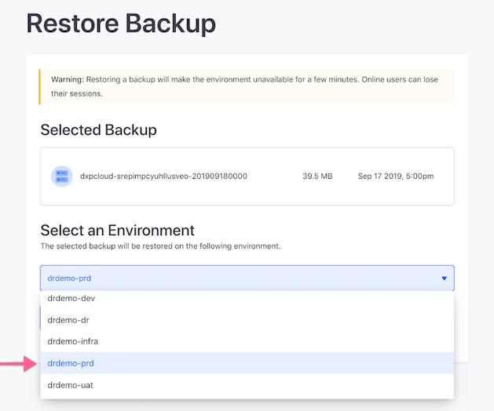

# Disaster Recovery

DXP Cloud provides two ways for customers to take advantage of the Disaster
Recovery (DR) procedure in the case of major incidents.

**Automatic Disaster Recovery**: DXP Cloud performs automatic disaster recovery
protocols by replicating services between three Availability Zones in different
geographic locations within the same Region. In case any of the Availability
Zones become unavailable, the Load Balancer will automatically route to the
remaining Availability Zones without requiring DNS changes on the customer side.
In this situation, *no action is required from the customer during an incident*.

**Cross-Region Disaster Recovery**: The Disaster Recovery procedure as explained
in this document is only necessary when there is a compromise in all three
Availability Zones in the same region at the same time.

This article documents the steps required to help a customer recover data
manually during a cross-region disaster:

* [Initial Setup](#initial-setup)
* [During an Incident](#during-an-incident)
* [Post-incident Recovery](#post-incident-recovery)

## Initial Setup

Liferay offers a fifth DXP Cloud environment to manage a cross region disaster.
In this scenario, assume that a production environment is stored in the
*eu-west-2* region and the region is compromised. To prevent downtime and
data loss on the production environment, the Disaster Recovery environment
should be shifted to outside the region of operation, such as *us-west1*. This
fifth Disaster Recovery (shortened to DR) environment thus serves as a backup
to store new user data generated during the incident.

DXP Cloud customers wishing to set up a Disaster Recovery environment must first
contact their sales representative in order for the DR environment to be
provisioned. This new environment is listed with the other available
environments (e.g., `dev`, `infra`, `uat`, and `prd`).

### Verify VPN Settings in the DR environment

Communications between the DR environment and production may go through a VPN.
To ensure the two environments are connected:

1. Click the DR environment's *Settings* tab in the left menu.

1. In the VPN section, enter the following:
    * **VPN Type**: OpenVPN
    * **Server Address**: The server address.
    * **Account Name**: The administrator's email address.
    * **Password**: The administrator's password.
    * **Certificate**: The certificate code.
    * **Forwarding IP**: The forwarding IP address.
    * **Forwarding Port**: The forwarding port number.
    * **Local Hostname**: The VPN's hostname.
    * **Local Port**: The local port number.

1. Click *Connect VPN*.

For more information on connecting to a VPN, see
[VPN Connection](/docs/-/knowledge_base/dxp-cloud/vpn-connection).

### Deploy the Latest Stable Build from Production to the DR Environment

Now you must deploy the latest stable build on production to the DR environment.
To do so, follow the instructions in
[Deploying to a Different Environment](/docs/-/knowledge_base/dxp-cloud/deployments#deploying-to-a-different-environment)
to deploy that build to the DR environment.

## During an Incident

Continuing the example above, the production environment hosted in the
*eu-west-2* region is scheduled to be backed up hourly at 2:00 PM local time and
that the region is compromised at 2:30 PM local time. Because no backups have
been generated in the intervening half hour, it is necessary to restore a backup
of database and documents from the Production environment to the Disaster
Recovery environment. The last stable environment is the version created at 2:00
PM.

### Copy Latest Production Data to the DR Environment

Follow these steps to restore the latest stable backup of production to the DR
environment:

1. In the DR environment, click the *Backups* tab on the left.
1. The Backup History lists the backups in two tabs: one for the DR environment
    and one for the production environment. Click the tab corresponding to the
    production environment.
1. For the latest stable backup in the production environment, click the
    *Actions* button
    ()
    then select *Restore*.

### Direct Custom Domain Traffic to the DR Environment

The web server service's custom domain in the DR environment must match that of
the original production environment. You must also delete that configuration
from the production environment. Follow these steps to do so:

1. In the DR environment, select *Services* in the left menu.
1. Click *webserver* in the list of Services.
1. Click the *Custom Domains* tab and configure the custom domain to match that
    of the production environment.
1. Navigate to the same setting in the production environment, and remove the
    custom domain configuration.
1. Update the DNS records. For more information, see
    [Custom Domains](/docs/-/knowledge_base/dxp-cloud/custom-domains).

This will result in all traffic being directed to the DR environment.

## Post-incident Recovery

Once the regional incident is over, you must shift back to the original region's
production environment (*eu-west2* in this example). Do this via these steps:

* [Create a Manual Backup in the DR Environment](#create-a-manual-backup-in-the-dr-environment)
* [Restore the Manual Backup from DR to Production](#restore-the-manual-backup-from-dr-to-production)
* [Update the Web Server Custom Domain in Production](#update-the-web-server-custom-domain-in-production)

### Create a Manual Backup of the DR Environment

During the incident, the DR environment functions as the production environment
and therefore contains new data. To preserve this data, you must back up the DR
environment. Follow these steps to do so:

1. In the DR environment, click *Backups* in the menu on the left.
1. Click *Backup Now*.

### Copy Latest DR Environment Data to Production

1. In the DR environment, click *Backups* in the menu on the left.
1. The Backup History lists the backups in two tabs: one for the DR environment
    and one for the production environment. Click the tab corresponding to the
    DR environment.
1. For the most recent backup (the one you just created), click the
    *Actions* button
    ()
    then select *Restore*.
1. Select the production environment and click *Deploy Build*.

### Restore Server Custom Traffic to Production

Because the webserver service redirected all traffic to the DR environment during the incident, system administrators must update these settings again so that all traffic is redirected back to
the the Production environment.

1. Navigate to _Services_ on the left menu.
1. Click on _webserver_ in the list of Services.
1. Click the _Custom Domains_ tab.

    

1. Remove the custom domain from the Production environment.
1. Update the DNS records. For more information, see the [Custom Domain](https://help.liferay.com/hc/en-us/articles/360032856292) article.
1. Click _Update Custom Domain_.
